# Piano di Trattamento NA — parquet model preprocessed

**Parquet sorgente**: `output/parquet/bando_cig_all.parquet` (66 col × 9,468,795 righe)  
**Parquet target**: `output/parquet/model/preprocessed/` (M1/M2/M3.parquet)  
**Implementazione**: `pipeline/16_build_model_datasets.py`  
**Data**: 2026-04-08 (aggiornato 2026-04-12)

> **Invariante**: nei parquet preprocessed non esistono NA (tranne `label`, per design PU).
> Tutti i NA nelle colonne feature diventano il livello categoriale esplicito `"MISSING"`.
> R e Python leggono `"MISSING"` come livello reale, non come NA.

---

## Legenda trattamenti

| Codice | Descrizione |
|---|---|
| `IMPUTA_MEDIANA` | Imputa con mediana del dataset (o RF se preferito) |
| `IMPUTA_MODA` | Imputa con valore modale |
| `IMPUTA_COSTANTE` | Imputa con costante semanticamente giustificata |
| `DISCR_QUANTILI` | Discretizza in bin ai quantili + categoria MISSING |
| `DISCR_SOGLIE` | Discretizza con soglie naturali (per conteggi interi) + MISSING |
| `CATEG_MISSING` | Categoriale: NaN diventa categoria MISSING (già approvato) |
| `SOLO_NATIVI` | Escluso dal parquet model — analoghe binarie esistono; solo modelli nativi |
| `SOLO_NATIVI_DUBBIO` | Escluso per ora — nessun analogo diretto; da ridiscutere |

---

## Sezione 0 — Già approvati (flag 0/1/NaN → terza categoria)

Queste colonne non richiedono discussione. Nel parquet model diventeranno
categoriali a 3 livelli: 0 / 1 / MISSING.

| Colonna | NA% | Significato NaN |
|---|---|---|
| `flag_delega` | 91.7% | Contratto non delegato (non in bando) |
| `flag_vince_minimo` | 62.5% | Non in aggiudicazioni |
| `flag_progettazione_esterna` | 62.5% | Non in aggiudicazioni |
| `consegna_frazionata` | 84.4% | Non in avvio-contratto |
| `consegna_sotto_riserva` | 84.4% | Non in avvio-contratto |
| `flag_in_ritardo` | 96.8% | Nessun SAL registrato |

---

## Sezione 1 — Imputazione (NA trascurabile o semanticamente chiaro)

> ⚙️ **Implementazione**: tutti i valori di imputazione calcolati come **mediana dei valori non-zero** su M1 (intero dataset). Valori effettivamente usati nel build:

| Colonna | Valore imputato |
|---|---|
| `importo_complessivo_gara` | 31,540 |
| `finestra_offerta_giorni` | 14 |
| `lag_perfezionamento_giorni` | 40 |
| `flag_urgenza` | 0 (costante) |
| `pct_durata_sospesa` | 0 (costante) |
| `n_lotti_componenti` | 1 (costante) |

### `importo_complessivo_gara` — IMPUTA_MEDIANA_NONZERO
**NA: 0.1%** (11,204 righe) — quasi certamente casuale (dati mancanti sporadici)

> 💡 **Implementato**: mediana non-zero = **31,540**. NA <1% → impatto trascurabile.

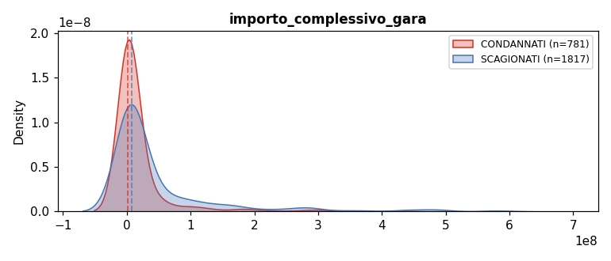

---

### `flag_urgenza` — IMPUTA_COSTANTE
**NA: 0.001%** (125 righe) — trascurabile

> 💡 **Implementato**: imputa con **0** (non urgente).

---

### `finestra_offerta_giorni` — IMPUTA_MEDIANA_NONZERO
**NA: 0.3%** (28,920 righe)

> 💡 **Implementato**: mediana non-zero = **14 giorni**.

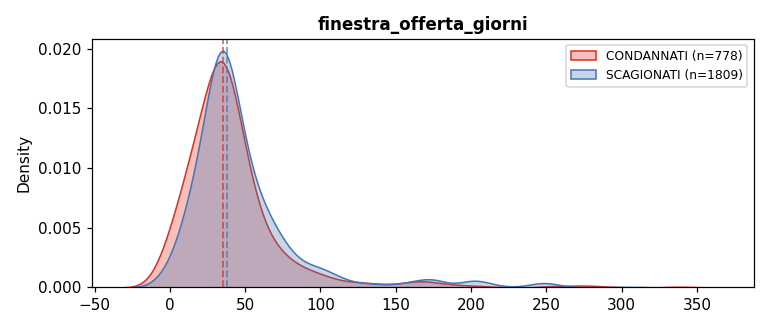

---

### `lag_perfezionamento_giorni` — IMPUTA_MEDIANA_NONZERO
**NA: 0.004%** (336 righe) — trascurabile

> 💡 **Implementato**: mediana non-zero = **40 giorni**.

---

### `pct_durata_sospesa` — IMPUTA_MEDIANA
**NA: 0.2%** (18,900 righe) — NA = durata_pianificata mancante per CIG con sospensioni

| Statistica | Valore |
|---|---|
| Range | [0, 10] (cappato) |
| P5 / Mediana / P95 | 0 / 0 / 0.45 |
| COND mediana | 0 |
| SCAG mediana | 0 |

> 💡 **Proposta**: imputa con 0 (mediana e valore più sensato: CIG con sospensione ma durata ignota → assumi proporzione assente).

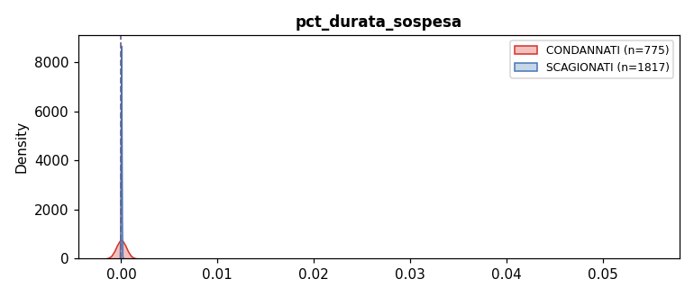

---

### `n_lotti_componenti` — IMPUTA_COSTANTE
**NA: 14.0%** (1,324,079 righe)

| Statistica | Valore |
|---|---|
| Moda | 1 (6,790,423 CIG — 83.5% dei non-null) |
| Valori unici | 510 |
| P95 | 10 |

> 💡 **Proposta**: imputa con **1** — NA semanticamente = "non specificato il numero di lotti" ma quasi certamente lotto singolo (la moda è schiacciante). Alternativa: RF, ma l'impatto è minimo dato che il dato è quasi categoriale.

---

## Sezione 2 — Discretizzazione con MISSING (NA elevato o non casuale)

> **Convenzione bin**: per DISCR_QUANTILI uso 4 bin (Q1/Q2/Q3/Q4) calcolati sui non-null.
> La categoria MISSING è sempre aggiunta come quinta categoria.
> Per DISCR_SOGLIE uso soglie naturali indicate nella proposta.

---

### `lag_comunicazione_esito_giorni` — DISCR_QUANTILI
**NA: 60.3%** — NA = CIG non in aggiudicazioni

| Statistica | Valore |
|---|---|
| Range | [-1,825, 5,475] |
| P5 / P25 / Mediana / P75 / P95 | 0 / 107 / 336 / 739 / 1,643 |
| COND mediana | 370 |
| SCAG mediana | 336 |

> 💡 **Proposta**: 4 bin quantili sui non-null + MISSING. Nota: valori negativi presenti (stessa causa SC-02) — includere nel primo bin.

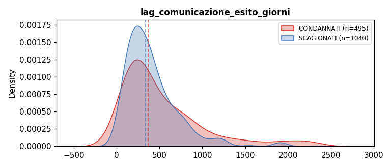

---

### `importo_sicurezza_pct` — DISCR_SOGLIE_FISSE
**NA: 73.9%** — NA quando importo_lotto = 0 o sicurezza non compilata

| Statistica | Valore |
|---|---|
| Range | [0, cappato] |
| P5 / P25 / Mediana / P75 / P95 | 0 / 0.002 / 0.010 / 0.024 / 0.062 |
| COND mediana | 0.0087 (0.87%) |
| SCAG mediana | 0.0023 (0.23%) |
| **Segnale** | **3.79x** ↑COND |

> ⚙️ **Implementato con bins fissi** (i quantili erano degeneri: >75% dei non-null = 0):
> `[0]` / `(0, 0.01]` / `(0.01, 0.03]` / `(0.03+]` / MISSING

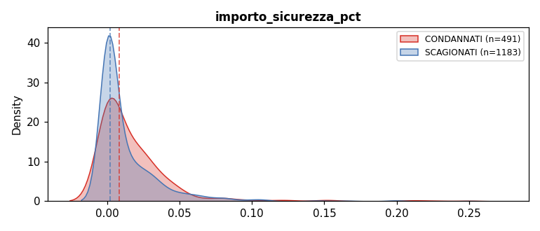

---

### `tasso_disoccupazione` — DISCR_QUANTILI
**NA: 35.0%** — NA = provincia mancante (non casuale)

| Statistica | Valore |
|---|---|
| Range | [2.0, 24.1] |
| P25 / Mediana / P75 | 5.8 / 8.2 / 12.5 |
| COND mediana | 10.1 |
| SCAG mediana | 6.5 |
| **Segnale** | **1.57x** ↑COND |

> 💡 **Proposta**: 4 bin quantili + MISSING. NA non casuale (province senza codice ISTAT) — non imputare.

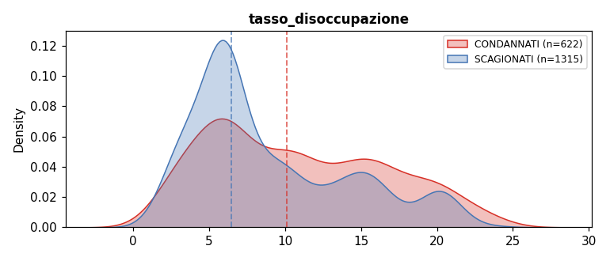

---

### `reddito_irpef_procapite` — DISCR_QUANTILI
**NA: 35.0%** — NA = provincia mancante (covariata con tasso_disoccupazione)

| Statistica | Valore |
|---|---|
| Range | [10,745, 29,948] |
| P25 / Mediana / P75 | 16,700 / 19,300 / 22,600 |
| COND mediana | 20,400 |
| SCAG mediana | 22,400 |

> 💡 **Proposta**: 4 bin quantili + MISSING. NA = stessa causa di tasso_disoccupazione.

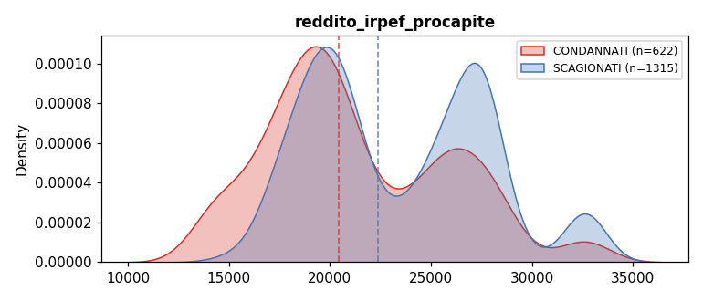

---

### `tasso_omicidi_100k` — DISCR_QUANTILI
**NA: 35.0%** — NA = provincia mancante

| Statistica | Valore |
|---|---|
| Valori unici | 51 (molto discreto) |
| P25 / Mediana / P75 | 0.3 / 0.6 / 0.9 |
| COND mediana | 0.6 |
| SCAG mediana | 0.6 |

> ⚠️ **Segnale bivariato quasi nullo** (mediana identica). Il segnale potrebbe emergere in modo multivariato o alle code.
> 💡 **Proposta**: 3 bin (Basso/Medio/Alto) + MISSING, oppure soglie naturali [0, 0.5, 1.0, max].

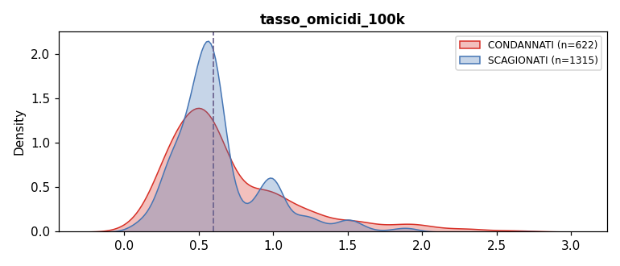

---

### `numero_offerte_ammesse` — DISCR_SOGLIE
**NA: 73.7%** — NA = non in aggiudicazioni

| Statistica | Valore |
|---|---|
| Range | [0, 4,000] |
| P5 / Mediana / P75 / P95 | 1 / 3 / 5 / 14 |
| COND mediana | 4 |
| SCAG mediana | 3 |
| Valori unici (non-null) | 468 |

> 💡 **Proposta soglie naturali**: [1] / [2] / [3-5] / [6-10] / [11+] / MISSING
> Alternativa quantili: ok se preferisci uniformità con le altre.

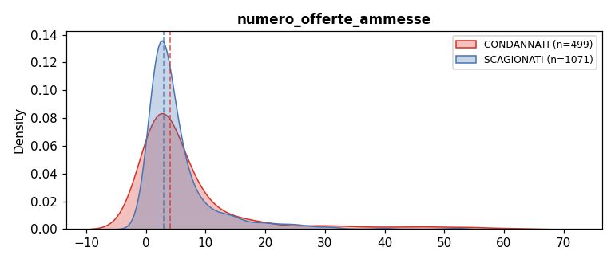

---

### `pct_offerte_escluse` — DISCR_QUANTILI
**NA: 83.2%** — NA = non in aggiudicazioni o denominatore zero

| Statistica | Valore |
|---|---|
| Range | [0, 1] |
| P25 / Mediana / P75 | 0 / 0.10 / 0.38 |
| COND mediana | ~0.10 |
| SCAG mediana | ~0.10 |

> 💡 **Proposta**: 4 bin + MISSING. Nota: molti zeri (nessuna esclusione) — possibile bin speciale [0] / (0, 0.25] / (0.25, 0.5] / (0.5, 1].

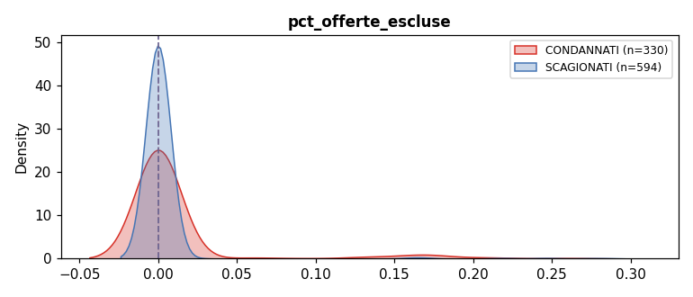

---

### `ribasso_aggiudicazione` — DISCR_QUANTILI
**NA: 62.8%** — NA = non in aggiudicazioni

| Statistica | Valore |
|---|---|
| Range | [-100, 100] |
| P5 / P25 / Mediana / P75 / P95 | 0.5 / 5.4 / 14.7 / 27.5 / 51.2 |
| COND mediana | 13.5% |
| SCAG mediana | 15.0% |

> 💡 **Proposta**: 4 bin quantili + MISSING. Condannati hanno ribasso leggermente inferiore (cartello mantiene prezzi alti).

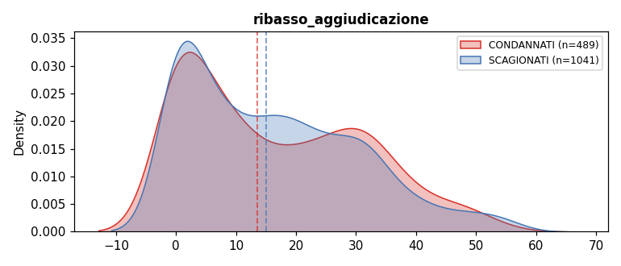

---

### `ribasso_spread` — DISCR_QUANTILI
**NA: 88.8%** — solo procedure con ≥2 offerte valide

| Statistica | Valore |
|---|---|
| Range | [0, ~50] |
| P25 / Mediana / P75 | 1.1 / 5.3 / 14.6 |
| COND mediana | ~5 |
| SCAG mediana | ~5 |

> 💡 **Proposta**: 4 bin quantili + MISSING.

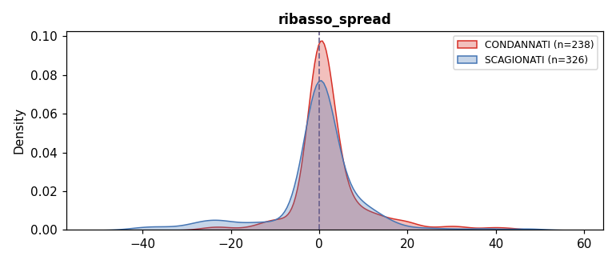

---

### `lag_aggiudicazione_giorni` — DISCR_QUANTILI
**NA: 70.4%** — NA = non in aggiudicazioni

| Statistica | Valore |
|---|---|
| Range | [0, ~3,000] (negativi → NaN) |
| P25 / Mediana / P75 / P95 | 35 / 93 / 207 / 608 |
| COND mediana | 157 |
| SCAG mediana | 218 |

> 💡 **Proposta**: 4 bin quantili + MISSING. COND ha lag più basso (aggiudicazione più rapida — coerente con cartello pre-accordato).

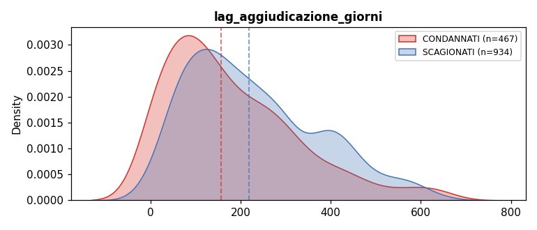

---

### ~~`delta_coerenza_pct`~~ — **DROPPATA**
Segnale spurio da `importo_sicurezza_pct`. Vedi SC-03 in decisions_log.md. Rimossa dal parquet principale (66 col) e da questo piano.

---

### `importo_aggiudicazione` — DISCR_QUANTILI
**NA: 62.6%** — NA = non in aggiudicazioni

| Statistica | Valore |
|---|---|
| Range | [0, ~5B] |
| P5 / P25 / Mediana / P75 / P95 | 7K / 42K / 130K / 430K / 2.7M |
| COND mediana | 664K |
| SCAG mediana | 2.46M |

> 💡 **Proposta**: 4 bin quantili su scala log + MISSING. Distribuzione molto asimmetrica — la scala log cattura meglio le differenze.

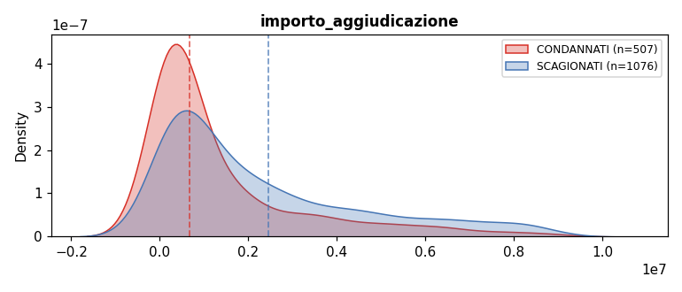

---

### `num_imprese_offerenti` — DISCR_SOGLIE
**NA: 73.7%** — NA = non in aggiudicazioni

| Statistica | Valore |
|---|---|
| Range | [0, 4,000] |
| P5 / Mediana / P75 / P95 | 1 / 3 / 5 / 15 |
| COND mediana | 4 |
| SCAG mediana | 3 |

> 💡 **Proposta soglie**: [1] / [2] / [3-5] / [6-10] / [11+] / MISSING (stessa logica di numero_offerte_ammesse).

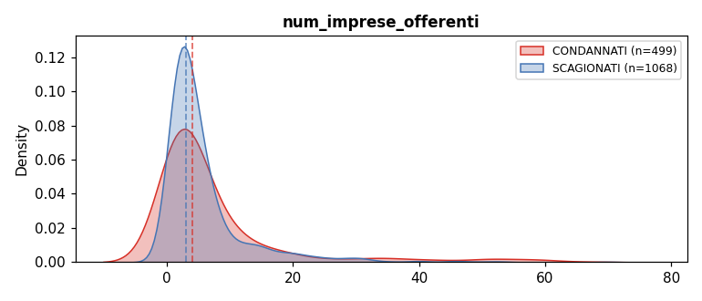

---

### `numero_offerte_escluse` — DISCR_SOGLIE
**NA: 74.3%** — NA = non in aggiudicazioni

| Statistica | Valore |
|---|---|
| Mediana | 0 |
| P75 / P95 | 1 / 5 |

> 💡 **Proposta soglie**: [0] / [1] / [2-3] / [4+] / MISSING.

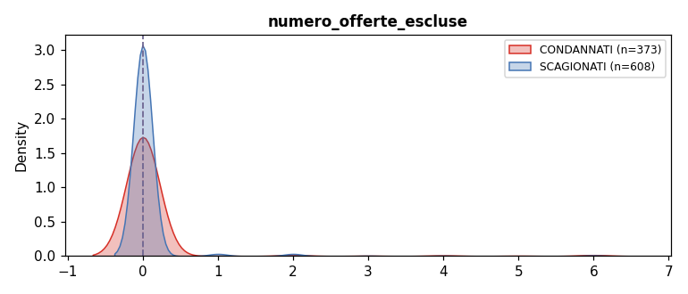

---

### `lag_stipula_aggiudicazione_giorni` — DISCR_QUANTILI
**NA: 89.8%** — NA = non in avvio-contratto

| Statistica | Valore |
|---|---|
| Range | [0, ~2,000] (negativi → NaN) |
| P25 / Mediana / P75 / P95 | 23 / 64 / 137 / 348 |
| COND mediana | 79 |
| SCAG mediana | 93 |

> 💡 **Proposta**: 4 bin quantili + MISSING.

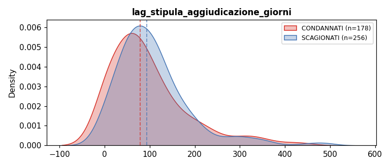

---

### `durata_pianificata_giorni` — DISCR_QUANTILI
**NA: 87.3%** — NA = non in avvio-contratto

| Statistica | Valore |
|---|---|
| Range | [1, ~10,000] |
| P25 / Mediana / P75 / P95 | 60 / 180 / 365 / 730 |
| COND mediana | 364 |
| SCAG mediana | 729 |

> 💡 **Proposta**: soglie naturali per leggibilità: [≤30] / (30, 90] / (90, 180] / (180, 365] / (365, 730] / [730+] / MISSING.
> Oppure 4 bin quantili — a te la scelta.

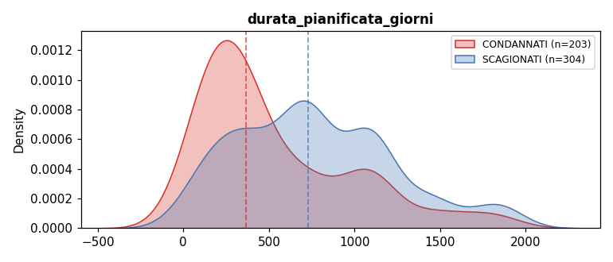

---

### `pct_riserva_base` — DISCR_QUANTILI
**NA: 72.0%** — NA = non in quadro economico

| Statistica | Valore |
|---|---|
| Range | [0, cappato 10] |
| P25 / Mediana / P75 / P95 | 0.033 / 0.106 / 0.228 / 0.598 |
| COND mediana | 0.219 |
| SCAG mediana | 0.085 |
| **Segnale** | **2.59x** ↑COND |

> 💡 **Proposta**: 4 bin quantili + MISSING. Segnale forte — preservare granularità.

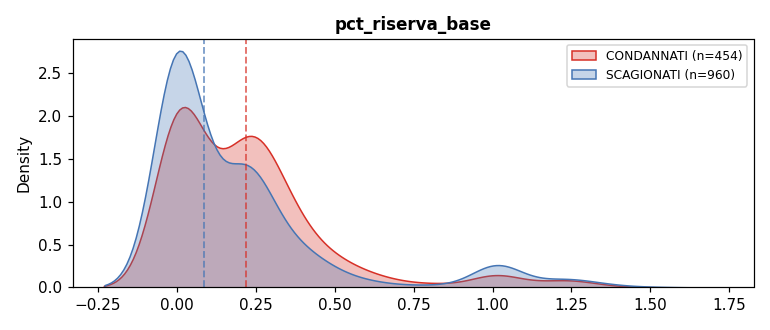

---

## Sezione 3 — Solo modelli nativi (escluse da parquet model)

### `pct_overrun_variante` — SOLO_NATIVI
**NA: 97.8%** — Analoghe binarie: `flag_variante_sostanziale` + `n_varianti` (entrambe 0% null)

### `pct_vita_prima_variante` — SOLO_NATIVI
**NA: 98.3%** — Analoga binaria: `flag_variante_oltre_termine` (0% null)

---

## Sezione 4 — Dubbio: escludere o discretizzare?

### `pct_overrun_core` — SOLO_NATIVI_DUBBIO
**NA: 93.6%** — Nessun analogo diretto.

| Statistica | Valore |
|---|---|
| Labeled non-null | COND=73, SCAG=14 |
| COND mediana | 0.49 |
| SCAG mediana | 0.91 |
| Segnale | **Invertito** (ma n troppo piccolo per concludere) |

**Opzioni**:
- A) Escludi dal parquet model → solo nativi
- B) Discretizza in 4 bin + MISSING (93.6% dei casi → categoria dominante "assente")
- C) Crea flag binario: `flag_consuntivo_presente` = 1 se non-null (segnale di completamento appalto)

> ❓ **Richiede decisione**

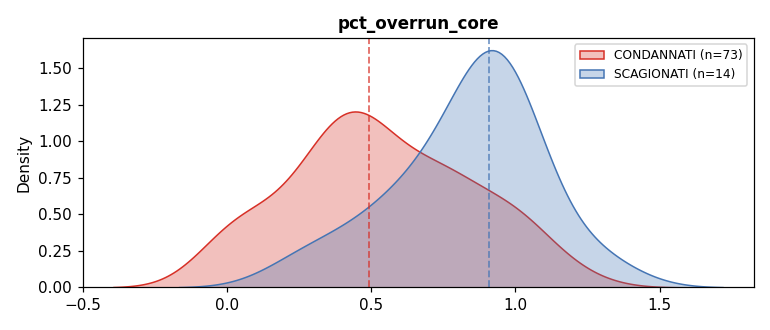

---

### `pct_riserva_consumata` — SOLO_NATIVI_DUBBIO
**NA: 93.6%** — Nessun analogo diretto. Stessa coverage di pct_overrun_core (stesso dataset QE CONSUNTIVO).

| COND mediana | SCAG mediana |
|---|---|
| 0.08 | 0.18 |

**Stesse opzioni di pct_overrun_core** — le due variabili condividono la stessa struttura di missingness (sono entrambe dal CONSUNTIVO del Quadro Economico).

> ❓ **Richiede decisione** (congiunta con pct_overrun_core)

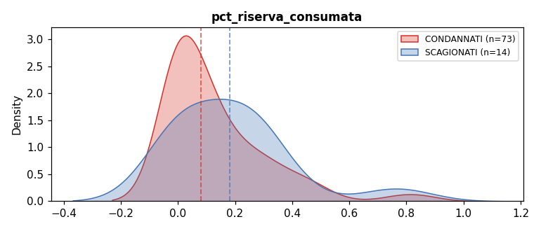

---

## Riepilogo finale

| Trattamento | N colonne | Colonne |
|---|---|---|
| `IMPUTA_MEDIANA/MODA/COST` | 6 | importo_complessivo_gara, flag_urgenza, finestra_offerta_giorni, lag_perfezionamento_giorni, pct_durata_sospesa, n_lotti_componenti |
| `DISCR_QUANTILI` | 12 | lag_comunicazione_esito_giorni, importo_sicurezza_pct, tasso_disoccupazione, reddito_irpef_procapite, tasso_omicidi_100k, pct_offerte_escluse, ribasso_aggiudicazione, ribasso_spread, lag_aggiudicazione_giorni, importo_aggiudicazione, lag_stipula_aggiudicazione_giorni, durata_pianificata_giorni, pct_riserva_base |
| `DISCR_SOGLIE` | 3 | numero_offerte_ammesse, num_imprese_offerenti, numero_offerte_escluse |
| `CATEG_MISSING` (flag 0/1) | 6 | flag_delega, flag_vince_minimo, flag_progettazione_esterna, consegna_frazionata, consegna_sotto_riserva, flag_in_ritardo |
| `CATEG_MISSING` (stringa) | 6 | oggetto_principale_contratto, sezione_regionale, tipo_scelta_4cls, natura_giuridica_SA, esito_collaudo, tipo_soggetto_agg |
| `CATEG_MISSING` (Int64 → string cat) | 2 | cod_strumento_svolgimento, cod_motivo_urgenza |
| `SOLO_NATIVI` | 2 | pct_overrun_variante, pct_vita_prima_variante |
| `SOLO_NATIVI_DUBBIO` | 2 | pct_overrun_core, pct_riserva_consumata |
